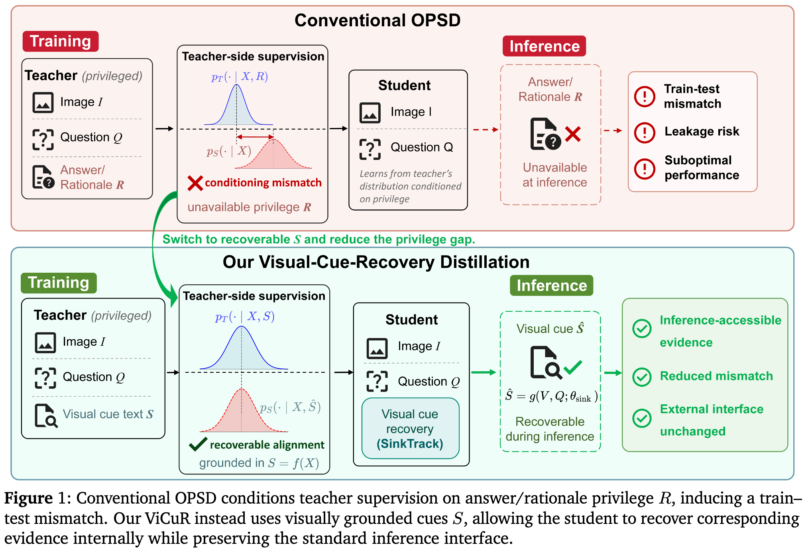
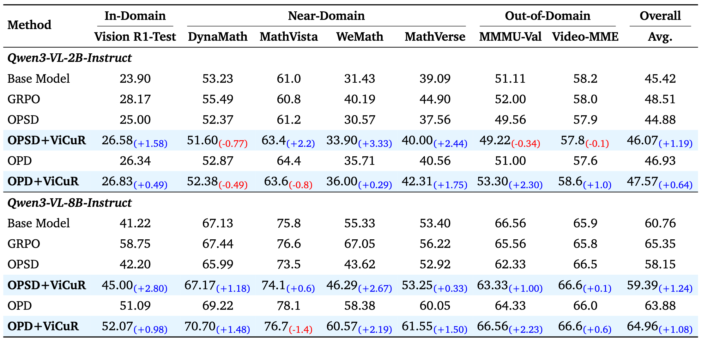

# ViCuR: Visual Cues as Recoverable Privilege for Multimodal On-Policy Distillation

<div align="center" style="margin-bottom:.5em;">
  <a target="_blank" href="https://tiankanghui.github.io/">Kanghui Tian<sup>*1,2</sup></a>,
  <a target="_blank" href="https://sirilaw.github.io/">Siyuan Liu<sup>*3</sup></a>,
  <a target="_blank" href="#">Ziang Yan<sup>1</sup></a>,
  <a target="_blank" href="#">Sheng Xia<sup>3</sup></a>,
  <a target="_blank" href="#">Shuai Dong<sup>2</sup></a>,
  <a target="_blank" href="https://shepnerd.github.io/">Yi Wang<sup><span style="font-family: 'Times New Roman', serif;">&dagger;1</span></sup></a>
  <br>
  <strong>
    <sup>1</sup>Shanghai AI Laboratory, <sup>2</sup>Fudan Univerisity, <sup>3</sup>Nanjing University
  </strong>
  <br>
  <sup>*</sup>Equal contribution &nbsp; <sup><span style="font-family: 'Times New Roman', serif;">&dagger;</span></sup>Corresponding author
</div>

<p align="center">
  <a href="assets/ViCuR.pdf">Paper</a> &nbsp;|&nbsp;
  <a href="#quick-start">Quick Start</a> &nbsp;|&nbsp;
  <a href="#citation">Citation</a>
</p>


## Introduction

This paper introduces **ViCuR**, a visually grounded privileged-teacher distillation framework for multimodal reasoning. It replaces conventional answer-based privileges with *visual cues* (query-related evidence in the input) and introduces a lightweight *cue recovery module* that uses dedicated sink-token cross-attention during prefill to aggregate task-relevant visual evidence into an internal representation,  without changing the inference interface or requiring auxiliary losses.

<p align="center">
  
</p>

## Highlights

- **Visual Cue Privilege**: Replaces answer/rationale-based teacher privilege with visually grounded cues, reducing the train-test mismatch inherent in conventional OPSD.
- **SinkTrack Cue Recovery**: A dedicated cross-attention module at selected transformer layers that aggregates task-relevant visual evidence into the sink token during prefill — no extra decoding overhead.
- **Consistent Improvements**: +1.19 (2B) and +1.24 (8B) over answer-based OPSD, and +0.64 (2B) / +1.08 (8B) over stronger-teacher OPD, across seven multimodal reasoning benchmarks.

## Results

<!-- Main results with Qwen3-VL-2B and 8B students on in-domain, near-domain, and out-of-domain benchmarks:

| Method | Vision R1-Test | DynaMath | MathVista | WeMath | MathVerse | MMMU-Val | Video-MME | Avg. |
|:---|:---:|:---:|:---:|:---:|:---:|:---:|:---:|:---:|
| **Qwen3-VL-2B-Instruct** | | | | | | | | |
| Base Model | 23.90 | 53.23 | 61.0 | 31.43 | 39.09 | 51.11 | 58.2 | 45.42 |
| OPSD | 25.00 | 52.37 | 61.2 | 30.57 | 37.56 | 49.56 | 57.9 | 44.88 |
| OPSD + ViCuR | **26.58** | 51.60 | **63.4** | **33.90** | **40.00** | 49.22 | **57.8** | **46.07** |
| OPD | 26.34 | 52.87 | 64.4 | 35.71 | 40.56 | 51.00 | 57.6 | 46.93 |
| OPD + ViCuR | **26.83** | **52.38** | **63.6** | **36.00** | **42.31** | **53.30** | **58.6** | **47.57** |
| **Qwen3-VL-8B-Instruct** | | | | | | | | |
| Base Model | 41.22 | 67.13 | 75.8 | 55.33 | 53.40 | 66.56 | 65.9 | 60.76 |
| OPSD | 42.20 | 65.99 | 73.5 | 43.62 | 52.92 | 62.33 | 66.5 | 58.15 |
| OPSD + ViCuR | **45.00** | **67.17** | **74.1** | **46.29** | **53.25** | **63.33** | **66.6** | **59.39** |
| OPD | 51.09 | 69.22 | 78.1 | 58.38 | 60.05 | 64.33 | 66.0 | 63.88 |
| OPD + ViCuR | **52.07** | **70.70** | **76.7** | **60.57** | **61.55** | **66.56** | **66.6** | **64.96** | -->



Main results with Qwen3-VL-2B and 8B students on in-domain, near-domain, and out-of-domain benchmarks. ViCuR consistently
improves the overall average over the corresponding distillation baseline (OPSD or OPD) at both 2B and 8B scales.

## Repository Structure

This codebase is built upon [verl](https://github.com/volcengine/verl). Our modifications include:

```
vicur/
├── modeling_qwen3_vl.py   # SinkTrack cross-attention for Transformers (student training)
└── qwen3_vl.py            # SinkTrack cross-attention for vLLM (student rollout)

examples/on_policy_distillation_trainer/
├── run_qwen3_vl_example.sh   # OPSD/OPD training with ViCuR on Qwen3-VL
└── ...
```

Key contributions to the verl framework:
- **On-Policy Distillation (OPD/OPSD)**: Training scripts and configuration for on-policy distillation with multimodal support.
- **SinkTrack Cross-Attention**: Implementation of the cue recovery module in both Transformers and vLLM backends.
- **Teacher Prompt Support**: Added `teacher_prompt` dataset field for passing visual cue text to the teacher model during distillation.

## Quick Start

### 1. Environment Setup

Set up the base environment following the [verl official installation guide](https://github.com/volcengine/verl). 
Specifically, to ensure the correct environment configuration, pull the designated Docker image version by running:

```bash
docker pull verlai/verl:vllm011.latest
```
Then, replace the Qwen3-VL model code in your local Transformers and vLLM installations with the SinkTrack variants provided in model_sink_track/ (including model class registration).
### 2. Run Training

```bash
cd examples/on_policy_distillation_trainer
bash run_qwen3_vl_example.sh
```

Key configurations in the training script:
- `STUDENT_MODEL_PATH`: path to the student model (with SinkTrack cross-attention weights initialized)
- `TEACHER_MODEL_PATH`: path to the teacher model
- `distillation.teacher_prompt_key=teacher_prompt`: enables visual cue privilege from the dataset

## Citation

```bibtex
@article{tian2026vicur,
  title={ViCuR: Visual Cues as Recoverable Privilege for Multimodal On-Policy Distillation},
  author={Tian, Kanghui and Liu, Siyuan and Yan, Ziang and Xia, Sheng and Dong, Shuai and Wang, Yi},
  year={2026}
}
```

## License

This project is licensed under the Apache License 2.0, following the license of the original verl framework.

## Acknowledgements

This codebase is built upon [verl](https://github.com/volcengine/verl). We thank the authors for their open-source contributions.
